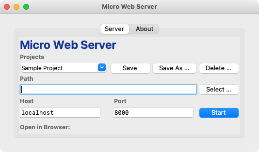
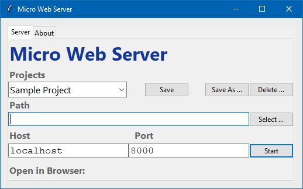

# Micro Web Server

An implementation of the Python Web Server

This is an implementation of a Micro Web Server, based on a sample found in [https://docs.python.org/3/library/http.server.html](https://docs.python.org/3/library/http.server.html).

This is not intended to be a substitute for more serious web server packages such as XAMPP or MAMP. However, it is useful if all you want to do is to develop

See [https://internotes.net/simple-web-server](https://internotes.net/simple-web-server) for a discussion on why this is useful.

There are two versions of the server, both for MacOS and Windows.

## GUI Usage

The GUI version of the server looks like this:

- MacOS

	

- Windows

	

Whenever you change any of the settings, they will be saved for next time. This uses a JSON file in `~/micro-web-server/prefs.json`.

### Basic Settings

The Host, Port and Path are automatically saved for next time.

1. Enter the __Path__ of the directory you wish to be served. You can use the __Select …__ button to select the directory.
2. The __Host__ defaults to `localhost`. Enter an alternative name or IP address if you have one.
3. The __Port__ defaults to `8000`. Choose another if you wish. You probably can’t select a number below `1024` without privileges.

### Saved Projects

You can save a host / port / directory combination as a project.

- To save a new project setting, select __Save As …__. You will be prompted for a project name.
	If you make any changes to a selected project, you can save the using the __Save__ button.
- To use an existing project setting, select one from the __Projects__ list.
- To delete an existing project setting, use the __Delete__ button. You can’t delete the `Default` project.

Note:

- Project names are case insensitive.
- If you save a new project with an existing name, it will replace the old project.

### Starting the Sever

Click on the __Start__ button. When you start, the __Start__ button will turn into __Stop__.

### Launching the Web Browser

Once the server has started, you will also see a link to launch the site in your default browser. Click on this link.

##	CLI Usage

If you prefer to use the command line version, its usage is below:

- __MacOS__: `PythonWebServer [options] ["path"]`
- __Windows__: `PythonWebServer.exe [options] ["path"]`

Here are the options and their defaults:

| Short | Full     | Meaning                         |
|-------|----------|---------------------------------|
| -h    | --help   | Show Help                       |
|       | --host   | Host URL                        |
| -p    | --port   | Port Number                     |
| -s    | --save   | Save Settings as "Project Name" |
| -r    | --read   | Open Settings "Project Name"    |
| -d    | --delete | Delete Settings "Project Name"  |
| -g    | --go     | Open in Web Browser             |

Although not always required, its generally better to put the directory inside "quotes", to avoid problems with spaces.

### Host, Port & Path

The Host, Port and Path are automatically saved for next time.

- The Host defaults to the previously saved host, or `localhost` if this is the first time. It should probably stay that way. If you have added some hosts in your `etc/hosts` file, you can use those.
- The Port defaults to the previously saved port, or `8000` if this is the first time. If you run this multiple times, you will need to make sure that this is different each time.
- The Path defaults to the current directory. If you use `-`, then it will be the previously saved path.

### Saved Projects

You can save a host / port / directory combination as a project.

- To save a new project setting, use `--save "Project Name"`
- To use an existing project setting, use `--read "Project Name"`
- To delete an existing project setting, use `--delete "Project Name"`

The `"Project Name"` can be anything you like. You don’t have to use "quotes" unless you have spaces in the name. Best to use them anyway.

Note:

- Project names are case insensitive
- If you save an project setting with an existing name, it will replace the saved setting.

### Launching the Web Browser

If you include the __go__ option (`-g` or `--go`), your site will open up in your default web browser, after a delay of a few seconds.

## TODO

2. Tabbed Interface with About etc

## E&OE

This application is still in an early stage. It does what it does and doesn’t do what it doesn’t do.
