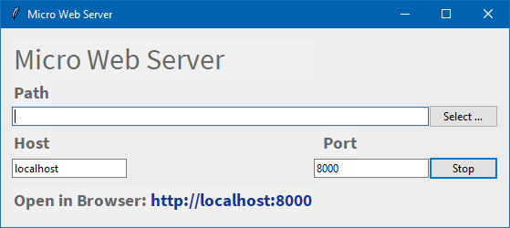

# Micro Web Server

An implementation of the Python Web Server

This is an implementation of a Micro Web Server, based on a sample found in [https://docs.python.org/3/library/http.server.html](https://docs.python.org/3/library/http.server.html).

This is not intended to be a substitute for more serious web server packages such as XAMPP or MAMP. However, it is useful if all you want to do is to develop

See [https://internotes.net/simple-web-server](https://internotes.net/simple-web-server) for a discussion on why this is useful.

There are two versions of the server, both for MacOS and Windows.

## GUI Usage

The GUI version of the server looks like this:

- MacOS

	

- Windows

	

1. Enter the __Path__ of the directory you wish to be served. You can use the `[...]` button to select the directory.
2. The __Host__ defaults to `localhost`. Enter an alternative name or IP address if you have one.
3. The __Port__ defaults to `8000`. Choose another if you wish. You probably can’t select a number below `1024` without privileges.

When you start, the __Start__ button will turn into __Stop_.

##	Usage

General:

- __MacOS__: `PythonWebServer --directory="…" --host=… --port=…`
- __Windows__: `PythonWebServer.exe --directory="…" --host=… --port=…`

The `--directory`, `--host` and `--port` parameters are all optional. Here are the options and their defaults:

| Short | Full         | Meaning            | Default             |
|-------|--------------|--------------------|---------------------|
| -h    | --help=      | Show Help          |                     |
| -d    | --directory= | Directory to Serve | (current directory) |
|       | --host=      | Host URL           | localhost           |
| -p    | --port=      | Port Number        | 8000                |

Although not always required, its generally better to put the directory inside "quotes", to avoid problems with spaces.

## E&OE

This application is still in an early stage. It does what it does and doesn’t do what it doesn’t do.
